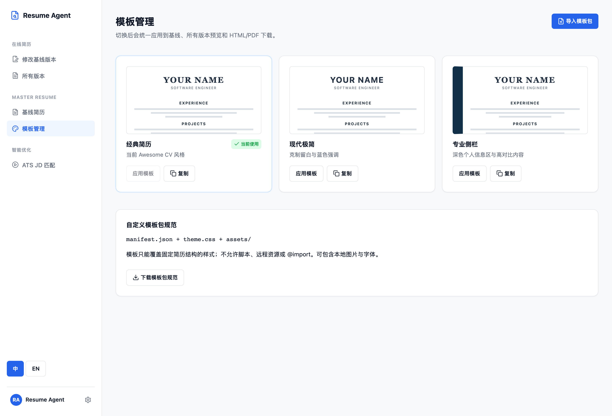

# Resume Generator

[简体中文](README.zh-CN.md) · [English](README.md)

> Safely tailor one trusted resume to each job description—with reviewable changes, visible diffs, and rollback.

Resume Generator is a local-first AI workspace for tailoring your resume to a specific job description. It compares a trusted baseline resume with the target role, identifies supported matches and gaps, produces a role-specific candidate, and fact-checks every change before export.

You do not need to rewrite your resume from scratch for every role, and you do not need to accept invented experience. The system works only within verified resume facts—helping you prioritize, reframe, and refine them through changes you can review, compare, and roll back.

## Contents

- [Interface](#interface)
- [Capabilities](#capabilities)
- [Workflow](#workflow)
- [Quick start](#quick-start)
- [User guide](#user-guide)
- [Template package authoring guide](#template-package-authoring-guide)
- [Templates and attribution](#templates-and-attribution)
- [Architecture](#architecture)
- [Project structure](#project-structure)
- [Configuration](#configuration)

## Interface

The template workspace switches the style used consistently by baseline previews, generated versions, and HTML/PDF exports. The screen below uses built-in placeholder copy only—no personal resume data.



## Capabilities

| Capability | What you get |
| --- | --- |
| **Precise JD tailoring** | Analyze role requirements and identify experience that is supported, worth strengthening, or not supportable. |
| **AI rewriting without invention** | Every change is bounded by baseline facts; unsupported skills, projects, metrics, and experience are not written in. |
| **Two human approval gates** | Review the rewrite strategy first, then the final candidate; you retain publishing control throughout. |
| **Version history and one-click rollback** | Baseline publications and role-specific versions retain their history and diffs, so an unsatisfactory change is always reversible. |
| **One baseline, many applications** | Each target role keeps its own candidate, evaluation, and export artifacts without affecting another. |
| **Fast import and bilingual maintenance** | Start from an existing PDF, DOCX, image, or YAML file; single-language content is neither translated nor completed without your review. |

## Workflow

```text
Baseline resume ── edit draft ── publish ──> web/data/resume.yaml
       │                                      │
       ├── version history / rollback          └── sole source of truth
       │
       └── target job description
                │
                ▼
      JD analysis → matching → HR review → rewrite strategy
                                               │
                                  human strategy approval
                                               │
                                               ▼
                            structured patch → fact validation → hiring review
                                               │
                                  human final approval / export
                                               ▼
                                          HTML / PDF
```

Two approval gates keep the workflow deliberate: approve the proposed strategy before generation, then approve the final validated version before export. A failed fact check returns the candidate to revision; it never changes the baseline resume.

## Quick start

### Prerequisites

- Python 3.12+
- Node.js 20+ and `pnpm`
- Chromium (used for PDF rendering)

### Install

```bash
cp .env.example .env
# Set RESUME_AGENT_API_KEY in .env to use ATS JD matching.
uv sync
uv run playwright install chromium
pnpm --dir agent/frontend install
```

On first start, the app copies `web/data/resume.sample.yaml` to the ignored local file `web/data/resume.yaml`. Replace that generated file with your own bilingual resume; it is intentionally never committed to Git.

### Run locally

macOS / Linux:

```bash
./dev.sh
```

Windows PowerShell:

```powershell
.\dev.ps1
```

If the local execution policy blocks scripts, use this one-time invocation:

```powershell
powershell -ExecutionPolicy Bypass -File .\dev.ps1
```

Open <http://localhost:5173>. The API is available at <http://127.0.0.1:8010>.

## User guide

### 1. Create and publish your baseline resume

1. Open **Modify baseline resume** in the sidebar.
2. Optionally select **Import resume** and upload a PDF, DOCX, PNG/JPG/WEBP image, or YAML file. The result is written to the draft, never directly to the baseline.
3. A single-language source is never translated or completed automatically: fields for the missing language remain blank for your review.
4. Edit Chinese and English fields in the draft, then preview the result.
5. Select **Publish** only when it is ready to become your source of truth.
6. Use the version list to inspect or restore a previously published baseline when necessary.

The published file is `web/data/resume.yaml`. Agent runs read it but never write, reformat, or migrate it.

#### Scanned-document parsing

The default `rapidocr` runs entirely on the local device: it is suitable for ordinary scanned resumes, is available after installing project dependencies, and never sends the original file away. For complex multi-column layouts or tables, switch to `mineru_api` in `.env`. That option uploads the original file to MinerU and returns structured Markdown, so you must create a MinerU token and accept its data processing.

```env
# Default: lightweight, local, and privacy-first
RESUME_AGENT_SCAN_PARSER=rapidocr

# Optional: prioritizes complex layouts; the original file is uploaded to MinerU
RESUME_AGENT_SCAN_PARSER=mineru_api
RESUME_AGENT_MINERU_API_TOKEN=your_token
RESUME_AGENT_MINERU_MODEL_VERSION=vlm
```

### 2. Tailor a resume to a job description

1. Open **ATS JD matching** and create a run for the target role.
2. Paste the job description and start the analysis.
3. Review the fit analysis and rewrite strategy; approve it, revise it, or stop the run.
4. Review the generated candidate, its patch/diff, fact-validation result, and hiring evaluation.
5. Approve the final version to export HTML or PDF; you can also restore the original baseline-derived version.

Each run is isolated below `agent/data/runs/<run_id>/`, so role-specific artifacts do not overwrite the baseline or one another.

### 3. Select or import a template

1. Open **Template management**.
2. Apply one of the built-in themes, or import a local ZIP package.
3. The selected theme is immediately used by previews and future exports.

Custom packages contain `manifest.json`, `theme.css`, and optional local `assets/`. They may style the fixed resume DOM but cannot execute code, add fields, change A4 page settings, load remote resources, or use CSS `@import`. See the [template package specification](docs/template-package-spec.md).

### 4. Template package authoring guide

A custom template package changes only the resume's presentation; it cannot read, modify, or add resume data. A package is a ZIP file whose root must contain `manifest.json` and `theme.css`; it may also include local fonts or image assets.

### 1. Create the directory

```text
my-template/
├── manifest.json
├── theme.css
├── preview.png            # Optional: a 4:3 template thumbnail is recommended
└── assets/                # Optional: local fonts, images, and other assets
    └── MyFont.woff2
```

When creating the ZIP, compress the directory contents directly so that `manifest.json` and `theme.css` are at its root. Do not wrap them in an additional `my-template/` directory.

### 2. Describe the template

Create `manifest.json`:

```json
{
  "id": "my-clean-template",
  "name": "My Clean Template",
  "description": "A one-page layout for technical roles",
  "unsupported": ["照片", "项目简介"]
}
```

- `id` is required. It may contain lowercase letters, digits, `-`, and `_`, has a 49-character limit, and must not duplicate an existing or built-in template.
- `name` is required and appears in Template management.
- `description` is recommended to explain when the template is suitable.
- `unsupported` is optional and declares fields that the template does not show. Its allowed values are listed in the [template package specification](docs/template-package-spec.md).

### 3. Write the CSS

Use `theme.css` to override styles for the fixed resume DOM. You can adjust typography, color, spacing, grids, borders, and pagination.

```css
@font-face {
  font-family: "My Font";
  src: url("assets/MyFont.woff2") format("woff2");
}

body { font-family: "My Font", "Noto Sans SC", sans-serif; }
.header { border-bottom: 2px solid #2563eb; }
.section-title { color: #1d4ed8; }
```

Use relative paths for package resources, such as `assets/MyFont.woff2`. Check Chinese, English, long text, and page breaks in the preview, then treat the PDF export as the final layout check.

### 4. Package and import

1. Compress the directory contents into a ZIP file.
2. Open **Template management** and import the local package.
3. Apply it and check baseline previews, candidate previews, and HTML/PDF exports.
4. To iterate, update the source directory, create a new ZIP, and import it again.

### Limits and troubleshooting

Packages may contain only CSS and local static assets: JavaScript, HTML templates, remote resources, CSS `@import`, `http/https` URLs, and path traversal (`..`) are not supported. A package also cannot change the A4 paper contract, page margins, data fields, or export filenames.

If import fails, check the ZIP-root layout, valid JSON in `manifest.json`, duplicate template IDs, and that every asset uses a package-relative path. See the [template package specification](docs/template-package-spec.md) for the complete constraints.

### 5. Export

From a baseline or approved candidate, choose the target language and download an A4 HTML or PDF file. HTML is useful for later browser printing; PDF is the final shareable artifact.

## Templates and attribution

The built-in **Classic** template uses the visual style of [Awesome-CV](https://github.com/posquit0/Awesome-CV), an outstanding LaTeX CV template by `posquit0`. This project adapts that presentation style for its fixed HTML/CSS rendering pipeline; it is not affiliated with Awesome-CV. Please see the upstream repository for its license and attribution details.

The other built-in themes are Modern Minimal and Professional Sidebar. All templates are presentation-only: switching a theme never changes resume facts, YAML content, or the A4 export contract.

## Architecture

```text
┌──────────────────────────── Browser workspace ────────────────────────────┐
│ React + TypeScript                                                         │
│ Baseline editor · Resume viewer · Template manager · ATS run review       │
└─────────────────────────────────────┬─────────────────────────────────────┘
                                      │ HTTP / local preview URLs
┌─────────────────────────────────────▼─────────────────────────────────────┐
│ FastAPI application                                                        │
│ Draft/version APIs · Run APIs · Template service · Download/preview APIs  │
└───────────────┬──────────────────────────────┬─────────────────────────────┘
                │                              │
     ┌──────────▼──────────┐        ┌──────────▼───────────────────────────┐
     │ Resume services      │        │ LangGraph agent workflow             │
     │ YAML + versions      │        │ JD analysis → strategy → patch       │
     │ templates + renderer │        │ validation → review → approval       │
     └──────────┬──────────┘        └──────────┬───────────────────────────┘
                │                              │
     web/data/resume.yaml             agent/data/runs/<run_id>/
     (published baseline)             (isolated local artifacts)
```

The application uses FastAPI for the local API, React + TypeScript for the browser workspace, LangGraph for the staged agent flow, Pydantic for structured validation, Jinja2/CSS for document rendering, and Playwright/Chromium for PDF generation. The OpenAI-compatible provider is configurable, with DeepSeek used in `.env.example` as the default endpoint.

## Project structure

```text
agent/
  src/resume_agent/       # FastAPI API, workflow, validation, template services
  frontend/               # React + TypeScript workspace
  prompts/                # Versioned role prompts for the agent workflow
  data/runs/              # Local, ignored role-specific run artifacts
web/
  data/resume.yaml        # Published baseline resume (never committed)
  data/resume.sample.yaml # Committed, sanitized starting example
  templates/              # Fixed resume HTML structure
  styles/                 # Base A4 resume styles
docs/
  images/                 # README images
  template-package-spec.md
```

Local archives, imported templates, logs, generated runs, `.env`, and PDF build output are excluded from version control.

## Configuration

Copy `.env.example` to `.env`.

| Variable | Purpose |
| --- | --- |
| `RESUME_AGENT_API_KEY` | API key for the OpenAI-compatible model provider; required for ATS matching. |
| `RESUME_AGENT_BASE_URL` | Provider endpoint. Defaults to DeepSeek in the example file. |
| `RESUME_AGENT_MODEL` | Model name used by the workflow. |
| `RESUME_AGENT_HIRING_THRESHOLD` | Score threshold used by optional automatic final approval. |
| `RESUME_AGENT_AUTO_APPROVE_MINUTES` | Wait time before optional automatic gate handling; use `0` to disable. |
| `RESUME_AGENT_SCAN_PARSER` | Scanned PDF/image parser: `rapidocr` (default, local) or `mineru_api` (MinerU cloud precision parsing). |
| `RESUME_AGENT_MINERU_API_TOKEN` | Required for `mineru_api`; the original resume is uploaded to MinerU, so confirm your data-processing consent. |
| `RESUME_AGENT_MINERU_MODEL_VERSION` | MinerU model: `pipeline` or `vlm` (the default, better for complex layouts). |
| `RESUME_AGENT_LANGSMITH_PROJECT_URL` | Optional link shown from runs when LangSmith tracing is configured. |

Keep `.env` private. The app is intended for local personal use and should not be exposed directly to the public internet.

## Development

```bash
uv run pytest -q
pnpm --dir agent/frontend build
```

## License

This project is licensed under the [Apache License 2.0](LICENSE).
